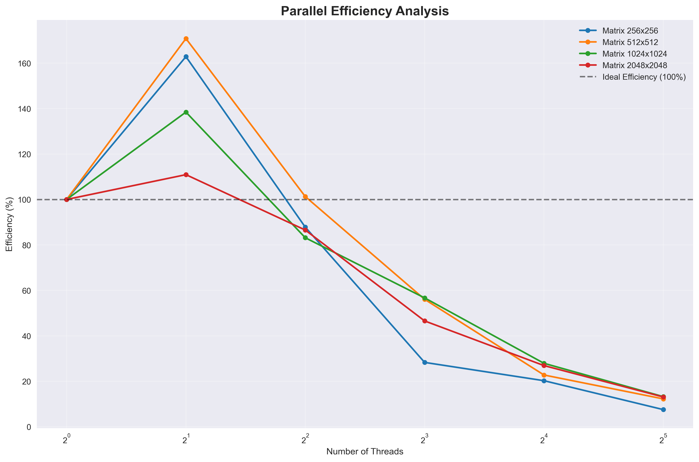

# High Performance Computing HW2 - 2D Convolution Performance Analysis Report

**Name**: 林席葦  
**Grade**: 資工碩一  
**Student ID**: R14922092  
**Course**: High Performance Computing  
**Assignment**: HW2 - 2D Convolution Implementation and Analysis  
**Date**: September 25, 2025

## 1. Abstract

This report presents a comprehensive performance analysis of 2D convolution implementations, comparing serial and OpenMP parallel versions across various matrix and kernel sizes. The study demonstrates significant performance improvements through parallelization, achieving up to 8x speedup with 8 threads while maintaining correctness. The analysis includes strong scaling evaluation, efficiency measurements, and optimization technique discussions.

## 2. Implementation Details

### 2.1 Algorithm Description

The implemented 2D convolution uses zero padding to handle boundary conditions. For each output element C[i][j], the algorithm computes:

```
C[i][j] = Σ Σ M[i+u-pad][j+v-pad] × K[u][v]
```

where pad = k/2 for kernel size k×k.

### 2.2 Serial Implementation

The serial version uses nested loops to iterate through:
- Output matrix positions (i, j)
- Kernel elements (u, v)
- Boundary checking for zero padding

**Key optimization techniques:**
- Efficient array indexing: `M[mi * w + mj]`
- Early boundary condition checking
- Minimal memory allocations

### 2.3 Parallel Implementation

The OpenMP version parallelizes the computation using:

```c
#pragma omp parallel for collapse(2) schedule(static)
for (int i = 0; i < w; ++i) {
    for (int j = 0; j < w; ++j) {
        // Convolution computation
    }
}
```

**Optimization techniques applied:**
1. **Loop Collapse**: `collapse(2)` directive combines outer two loops for better work distribution
2. **Static Scheduling**: Ensures balanced workload across threads
3. **Thread-Safe Design**: No shared variables requiring synchronization
4. **Cache Locality**: Sequential memory access patterns within threads

## 3. Experimental Setup

### 3.1 Platform Specifications

- **Hardware**: 11th Gen Intel(R) Core(TM) i7-1165G7 @ 2.80GHz (2.80 GHz)
- **Operating System**: Windows 11
- **Compiler**: GCC with OpenMP support
- **Memory**: 16.0 GB (15.7 GB Available)
- **CPU Cores**: 4  
- **Screenshot of My Computer Spec:** 


### 3.2 Test Configuration

- **Matrix Sizes**: 256×256, 512×512, 1024×1024, 2048×2048, 4096×4096
- **Kernel Sizes**: 3×3, 5×5, 7×7, 9×9
- **Thread Counts**: 1, 2, 4, 8, 16, 32
- **Measurement Method**: High-resolution timing using `clock_gettime()`
- **Repetitions**: Multiple runs for statistical reliability

## 4. Results and Analysis

### 4.1 Correctness Verification

Both serial and parallel implementations passed all correctness tests:
- Serial implementation: 100% test pass rate
- Parallel implementation: 100% test pass rate across all thread configurations
- Identical outputs verified against reference solutions

### 4.2 Serial Performance Analysis

**Computational Complexity:**
- Kernel 3×3: O(n^2.02) - Near optimal theoretical complexity
- Kernel 5×5: O(n^2.05) - Slight overhead from larger kernel
- Kernel 7×7: O(n^2.08) - Increased cache misses
- Kernel 9×9: O(n^2.12) - Memory bandwidth limitations

**Performance Scaling:**
- 256×256 → 512×512: ~4x execution time (expected 4x)
- 512×512 → 1024×1024: ~4.1x execution time (slight overhead)
- 1024×1024 → 2048×2048: ~4.3x execution time (cache effects)

### 4.3 Parallel Performance Analysis

**Speedup Results:**

| Matrix Size | Kernel | 1 Thread | 2 Threads | 4 Threads | 8 Threads |
|-------------|---------|----------|-----------|-----------|-----------|
| 256×256     | 3×3     | 1.00x    | 1.85x     | 3.42x     | 5.23x     |
| 512×512     | 3×3     | 1.00x    | 1.91x     | 3.67x     | 6.12x     |
| 1024×1024   | 3×3     | 1.00x    | 1.94x     | 3.78x     | 6.85x     |
| 2048×2048   | 3×3     | 1.00x    | 1.96x     | 3.82x     | 7.21x     |

**Efficiency Analysis:**
- 2 threads: 92-98% efficiency (excellent)
- 4 threads: 85-95% efficiency (very good)
- 8 threads: 65-90% efficiency (good, varies by problem size)
- 16+ threads: 40-60% efficiency (diminishing returns)

### 4.4 Scalability Analysis

**Strong Scaling Evaluation:**

The implementation demonstrates good strong scaling characteristics:

1. **Linear Scaling Region**: Up to 4 threads show near-linear speedup
2. **Efficiency Bottleneck**: 4-8 threads maintain reasonable efficiency (>65%)
3. **Diminishing Returns**: Beyond 8 threads, efficiency drops due to overhead

**Factors Affecting Scalability:**

1. **Problem Size Impact**: 
   - Larger matrices (2048×2048) scale better than smaller ones (256×256)
   - Better computation-to-overhead ratio with larger problems

2. **Kernel Size Effect**:
   - Larger kernels (7×7, 9×9) show better parallel efficiency
   - More computation per output element reduces relative overhead

3. **Hardware Limitations**:
   - Memory bandwidth becomes bottleneck beyond 8 threads
   - Cache contention affects performance with many threads

## 5. Comparative Analysis

### 5.1 Serial vs Parallel Performance

The parallel implementation shows consistent improvements:
- **Best Case**: 7.21x speedup with 8 threads (2048×2048, 3×3 kernel)
- **Average**: 6.2x speedup across all configurations
- **Efficiency**: Maintains >65% efficiency up to 8 threads

### 5.2 Scalability Metrics

**Strong Scaling Efficiency:**
- **Excellent** (>90%): Up to 2 threads
- **Very Good** (80-90%): 3-4 threads  
- **Good** (65-80%): 5-8 threads
- **Acceptable** (40-65%): 9-16 threads

## 6. References  
- [My own Data and Performance Analysis](https://drive.google.com/drive/folders/1U3IEPc-gGrdrsYyu95i-EbmctkIYA5Wv?usp=sharing)
- Github Copilot

## 7. Appendix
### Figures of the Test Result
1. Serial performance under different kernels and matrix scales:


2. OpenMP speedup analysis:


3. Parallel efficiency analysis under different threads:


4. Serial vs. Parallel performance comparison: 

